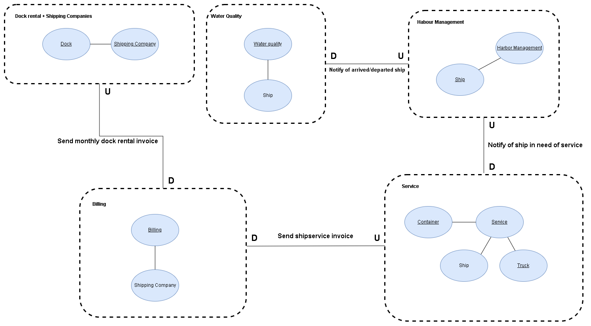
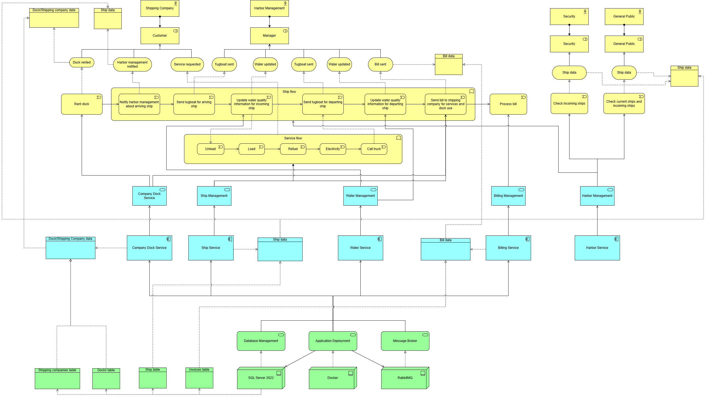

<div align="center">
  

  # ⚓ GiethoornHarbor

  ### Enterprise-Grade Microservices Harbor Management System

  [](https://dotnet.microsoft.com/)
  [](https://docs.microsoft.com/en-us/dotnet/csharp/)
  [](https://docs.microsoft.com/en-us/ef/core/)
  [](https://www.microsoft.com/sql-server)
  [](https://www.rabbitmq.com/)
  [](https://www.docker.com/)
  [](https://swagger.io/)
  [](https://microservices.io/)
  [](LICENSE)

  ---

  **This application was developed by Computer Science students at Avans University of Applied Sciences, as part of the course Solution Architecture.**

</div>

---

## 📖 About the Project

**GiethoornHarbor** is a sophisticated, production-ready harbor management system built on a modern **microservices architecture**. This comprehensive solution orchestrates all critical aspects of maritime harbor operations, including ship scheduling, dock allocation, billing automation, environmental monitoring, and ship service provisioning.

The system demonstrates enterprise-level software design patterns, event-driven communication, distributed databases, containerization, and scalable cloud-ready architecture - showcasing advanced proficiency in modern full-stack development practices.

### 🎯 Project Vision

Transform traditional harbor management into a digital, automated, and intelligent system that:
- ✅ Streamlines ship arrivals and departures with real-time scheduling
- ✅ Automates billing and invoice generation for all harbor services
- ✅ Monitors environmental conditions to ensure regulatory compliance
- ✅ Optimizes dock utilization and resource allocation
- ✅ Provides seamless service provisioning (refueling, electricity, cargo handling)
- ✅ Enables scalable, fault-tolerant operations through microservices

<div align="center">
  
  <p><i>System Architecture Context Diagram</i></p>
</div>

---

## 🏗️ Architecture & Design

### Microservices Architecture

GiethoornHarbor implements a **true microservices architecture** with complete service autonomy, independent databases, and asynchronous communication via message queues.



#### 🚢 Core Services

| Service | Port | Responsibility | Database |
|---------|------|----------------|----------|
| **Harbor Management** | 5282 | Ship arrivals, departures, scheduling & coordination | HarborDb (1434) |
| **Dock & Shipment Company** | 5283 | Dock allocation, rental management, company administration | DockDb (1437) |
| **Ship Service** | 5208 | Refueling, electricity, container handling operations | ShipServiceDb (1438) |
| **Billing Service** | 5206 | Payment processing, invoice generation, account management | BillingDb (1436) |
| **Water Management** | 5171 | Water quality monitoring, environmental compliance | WaterDb (1435) |

#### 🔧 Infrastructure Components

- **RabbitMQ** (5672, 15672) - Event-driven message broker enabling asynchronous inter-service communication
- **SQL Server 2022** - Dedicated database instances per service following database-per-service pattern
- **Docker & Docker Compose** - Containerized deployment with orchestration and health checks
- **Swagger/OpenAPI** - Comprehensive API documentation for all service endpoints

### 🔄 Event-Driven Communication

The system leverages **RabbitMQ** for loose coupling and scalability:

```
1. Ship Arrival Event → Triggers dock allocation → Notifies service scheduling
2. Service Completion Event → Generates billing record → Creates invoice
3. Payment Received Event → Updates company account → Releases dock reservation
4. Water Quality Alert Event → Triggers compliance check → Notifies harbor management
```

This event-driven approach ensures:
- 🎯 **Loose Coupling** - Services remain independent and resilient
- 📈 **Scalability** - Easy horizontal scaling of individual services
- 🔁 **Resilience** - Message persistence ensures no data loss during failures
- ⚡ **Performance** - Asynchronous processing improves response times

---

## ✨ Features & Capabilities

### 🚢 Ship Management
- **Real-time Tracking** - Monitor all ships in harbor with status updates (Planned, Arrived, Departed)
- **Automated Scheduling** - Intelligent arrival/departure scheduling and conflict resolution
- **Service Coordination** - Orchestrate refueling, loading, and maintenance operations
- **Historical Records** - Complete audit trail of all ship activities

### ⚓ Dock Management
- **Dynamic Allocation** - Real-time dock availability tracking and assignment
- **Rental Administration** - Flexible pricing models and rental period management
- **Company Integration** - Multi-tenant support for shipment company management
- **Automated Invoicing** - Generate dock rental invoices automatically upon departure

### 🔧 Ship Services
- **⛽ Refueling Services** - Fuel dispensing management with consumption tracking and automated billing
- **⚡ Electricity Provisioning** - Shore power supply for docked vessels with metered usage
- **📦 Container Handling** - Automated loading/unloading with specialized handling for:
  - 📦 Standard cargo
  - 🥬 Fresh/perishable goods (temperature-controlled)
  - 🐄 Livestock (with ventilation and care requirements)
  - 🔴 Fragile items (gentle handling protocols)
  - ☢️ Hazardous materials (safety compliance and documentation)
- **Service History** - Complete service logs per ship for analytics and optimization

### 💰 Billing & Payments
- **Automated Invoice Generation** - Smart billing based on services consumed and time docked
- **Multi-Service Aggregation** - Consolidated invoicing across dock rentals and ship services
- **Payment Processing** - Secure payment recording and account reconciliation
- **Company Accounts** - Credit management and payment history per shipment company
- **Financial Reporting** - Revenue tracking and financial analytics

### 🌊 Water Quality Monitoring
- **Real-time Assessment** - Continuous water quality measurement and scoring (0-100 scale)
- **Environmental Compliance** - Track adherence to maritime environmental regulations
- **Automated Alerts** - Instant notifications when water quality drops below thresholds
- **Historical Analysis** - Trend analysis and environmental impact reporting
- **Regulatory Reporting** - Generate compliance reports for environmental authorities

---

## 🚀 Getting Started

### Prerequisites

Before running GiethoornHarbor, ensure you have:

- 🐋 **Docker Desktop** (20.10+) and **Docker Compose** (2.0+)
- 💻 **.NET 8.0 SDK** (for local development)
- 🔧 **Visual Studio 2022** or **VS Code** with C# extension (recommended)
- 🖥️ **4GB+ RAM** available for containers

### Quick Start

Get the entire harbor management system running in under 2 minutes:

#### 1️⃣ Clone the Repository
```bash
git clone https://github.com/yourusername/GiethoornHarbor.git
cd GiethoornHarbor
```

#### 2️⃣ Start All Services
```bash
docker-compose up -d
```

This command will:
- Build all 5 microservices
- Launch 5 SQL Server database instances
- Start RabbitMQ message broker
- Configure health checks and service dependencies

#### 3️⃣ Verify Services are Running
```bash
docker-compose ps
```

All services should show status as "Up (healthy)"

#### 4️⃣ Access the System

Once running, the following endpoints are available:

| Service | Endpoint | Description |
|---------|----------|-------------|
| Harbor Management API | http://localhost:5282/swagger | Ship scheduling and coordination |
| Dock Management API | http://localhost:5283/swagger | Dock allocation and rentals |
| Ship Service API | http://localhost:5208/swagger | Refueling, electricity, containers |
| Billing API | http://localhost:5206/swagger | Payments and invoicing |
| Water Management API | http://localhost:5171/swagger | Environmental monitoring |
| RabbitMQ Console | http://localhost:15672 | Message queue management (guest/guest) |

### 🧪 Testing the System

Try these example workflows:

**1. Register a New Ship Arrival:**
```bash
POST http://localhost:5282/api/ships
{
  "shipName": "Ocean Voyager",
  "arrivalTime": "2025-10-16T14:00:00",
  "status": "Planned"
}
```

**2. Allocate a Dock:**
```bash
POST http://localhost:5283/api/docks/allocate
{
  "shipId": 1,
  "dockNumber": "A-7"
}
```

**3. Request Refueling Service:**
```bash
POST http://localhost:5208/api/refueling
{
  "shipId": 1,
  "fuelAmount": 5000
}
```

**4. Check Water Quality:**
```bash
GET http://localhost:5171/api/water-quality/latest
```

---

## 🛠️ Development

### Project Structure

```
GiethoornHarbor/
│
├── HarborManagementService/         # 🚢 Ship coordination and scheduling
│   ├── Controllers/                 # REST API endpoints
│   ├── Models/                      # Domain entities
│   ├── Data/                        # EF Core DbContext
│   ├── Services/                    # Business logic
│   └── Dockerfile
│
├── Dock-ShipmentCompany/            # ⚓ Dock allocation and rentals
│   ├── Controllers/
│   ├── Models/
│   ├── Data/
│   └── Dockerfile
│
├── ShipService/ShipService/         # 🔧 Ship services (fuel, power, cargo)
│   ├── Controllers/
│   ├── Models/
│   ├── Data/
│   ├── Services/                    # Refueling, electricity, container logic
│   └── Dockerfile
│
├── Billing/Billing/                 # 💰 Payment processing and invoicing
│   ├── Controllers/
│   ├── Models/
│   ├── Data/
│   └── Dockerfile
│
├── WaterManagement/                 # 🌊 Environmental monitoring
│   ├── Controllers/
│   ├── Models/
│   ├── Data/
│   └── Dockerfile
│
├── docker-compose.yml               # 🐋 Container orchestration
├── GiethoornHarbor.sln             # 💼 Visual Studio solution
├── ArchimateModel.png              # 📊 Architecture diagram
└── Context.png                     # 📐 System context diagram
```

### Building from Source

For local development without Docker:

#### 1️⃣ Restore NuGet Packages
```bash
dotnet restore
```

#### 2️⃣ Build the Solution
```bash
dotnet build
```

#### 3️⃣ Run Individual Service
```bash
cd HarborManagementService
dotnet run
```

#### 4️⃣ Run Tests (if available)
```bash
dotnet test
```

### 🗄️ Database Migrations

Each service maintains its own database schema using Entity Framework Core migrations.

**Create a new migration:**
```bash
cd HarborManagementService
dotnet ef migrations add MigrationName
```

**Apply migrations:**
```bash
dotnet ef database update
```

**View migration history:**
```bash
dotnet ef migrations list
```

### 🔧 Configuration

#### Environment Variables

Each service can be configured via environment variables (defined in `docker-compose.yml`):

| Variable | Description | Example |
|----------|-------------|---------|
| `ConnectionStrings__DefaultConnection` | SQL Server connection string | `Server=harbordb;Database=HarborDb;User=sa;...` |
| `RabbitMQ__HostName` | RabbitMQ server hostname | `rabbitmq` |
| `ASPNETCORE_ENVIRONMENT` | Runtime environment | `Development` / `Production` |

#### Database Configuration

Default SQL Server credentials (⚠️ change for production):
- **Username:** `sa`
- **Password:** `Your_password123!`
- **Trust Server Certificate:** `True`

#### RabbitMQ Configuration

- **Management UI:** http://localhost:15672
- **Default Credentials:** `guest` / `guest`
- **AMQP Port:** 5672
- **HTTP Management Port:** 15672

---

## 🔄 Message Flow & Integration

### Event-Driven Workflows

The system uses **event-driven architecture** to maintain loose coupling while ensuring data consistency:

#### 🚢 Ship Arrival Workflow
```
1. Harbor Management → Publishes ShipArrivedEvent to RabbitMQ
2. Dock Service → Receives event → Allocates available dock
3. Ship Service → Receives event → Prepares service schedule
4. Billing Service → Receives event → Creates new billing account
```

#### ⛽ Service Provisioning Workflow
```
1. Ship Service → Completes refueling → Publishes ServiceCompletedEvent
2. Billing Service → Receives event → Generates invoice line item
3. Harbor Management → Receives event → Updates ship service status
```

#### 💰 Payment Processing Workflow
```
1. Billing Service → Receives payment → Publishes PaymentReceivedEvent
2. Dock Service → Receives event → Marks rental as paid
3. Harbor Management → Receives event → Allows ship departure
```

#### 🌊 Water Quality Monitoring Workflow
```
1. Water Management → Detects quality drop → Publishes WaterQualityAlertEvent
2. Harbor Management → Receives event → Notifies harbor master
3. Billing Service → Receives event → May adjust pricing for services
```

### 🔌 API Integration

All services expose **RESTful APIs** documented with **Swagger/OpenAPI**:

- ✅ Standard HTTP methods (GET, POST, PUT, DELETE)
- ✅ JSON request/response bodies
- ✅ Comprehensive error handling with proper HTTP status codes
- ✅ Interactive API documentation via Swagger UI
- ✅ Support for CORS for web client integration

---

## 🎓 Learning Outcomes

This project demonstrates mastery of the following advanced software engineering concepts and technologies:

### 🏛️ Software Architecture
- ✅ **Microservices Architecture** - Designing autonomous, independently deployable services
- ✅ **Database per Service Pattern** - Implementing data isolation and service autonomy
- ✅ **Event-Driven Architecture** - Using message queues for asynchronous communication
- ✅ **Domain-Driven Design** - Structuring code around business domains (Harbor, Dock, Billing, etc.)
- ✅ **Service-Oriented Architecture (SOA)** - Building loosely coupled, reusable services
- ✅ **API Gateway Pattern** - Understanding service exposure and API management

### 💻 Backend Development
- ✅ **ASP.NET Core 8.0** - Building modern web APIs with the latest .NET framework
- ✅ **Entity Framework Core 9.0** - Implementing ORM with migrations and code-first approach
- ✅ **RESTful API Design** - Creating intuitive, standards-compliant web services
- ✅ **Dependency Injection** - Applying SOLID principles for maintainable code
- ✅ **Asynchronous Programming** - Using async/await for scalable applications
- ✅ **Middleware & Filters** - Implementing cross-cutting concerns (logging, validation, error handling)

### 🗄️ Database & Data Management
- ✅ **SQL Server 2022** - Working with enterprise-grade relational databases
- ✅ **Database Design** - Normalizing schemas and ensuring data integrity
- ✅ **EF Core Migrations** - Managing database schema evolution and versioning
- ✅ **Distributed Transactions** - Handling eventual consistency across services
- ✅ **Data Modeling** - Designing entities, relationships, and constraints

### 📨 Message Queues & Event Streaming
- ✅ **RabbitMQ** - Implementing publish/subscribe and message queue patterns
- ✅ **Event-Driven Communication** - Decoupling services through asynchronous messaging
- ✅ **Message Reliability** - Ensuring delivery guarantees and handling failures
- ✅ **Event Sourcing Concepts** - Understanding event-based state management

### 🐋 DevOps & Containerization
- ✅ **Docker** - Containerizing .NET applications for consistent deployments
- ✅ **Docker Compose** - Orchestrating multi-container applications
- ✅ **Container Health Checks** - Implementing service monitoring and auto-recovery
- ✅ **Environment Configuration** - Managing settings across development and production
- ✅ **Container Networking** - Configuring service-to-service communication in Docker

### 📊 API Documentation & Testing
- ✅ **Swagger/OpenAPI** - Generating interactive API documentation
- ✅ **API Versioning** - Planning for backward compatibility
- ✅ **Integration Testing** - Testing inter-service communication (future enhancement)
- ✅ **Postman/Swagger Testing** - Manual and automated API testing

### 🔐 Software Design Principles
- ✅ **SOLID Principles** - Single Responsibility, Open/Closed, Liskov Substitution, Interface Segregation, Dependency Inversion
- ✅ **Separation of Concerns** - Layered architecture with Controllers, Services, Data Access
- ✅ **DRY (Don't Repeat Yourself)** - Code reusability and maintainability
- ✅ **Clean Code** - Writing readable, self-documenting, and maintainable code
- ✅ **Error Handling** - Implementing robust exception handling and logging

### 🌐 Distributed Systems Concepts
- ✅ **Service Discovery** - Understanding how services locate each other
- ✅ **Circuit Breaker Pattern** - Planning for fault tolerance (future enhancement)
- ✅ **Eventual Consistency** - Managing data consistency in distributed environments
- ✅ **Scalability** - Designing for horizontal scaling of services
- ✅ **Resilience** - Building fault-tolerant systems with health checks and retries

### 🛠️ Tools & Technologies
- ✅ **Git & GitHub** - Version control and collaborative development
- ✅ **Visual Studio 2022** - Professional IDE for .NET development
- ✅ **NuGet Package Management** - Managing dependencies and libraries
- ✅ **C# 12** - Modern C# language features and best practices
- ✅ **LINQ** - Language-Integrated Query for data manipulation
- ✅ **JSON Serialization** - Working with structured data interchange

### 🎯 Business Domain Modeling
- ✅ **Harbor Operations** - Understanding real-world maritime logistics
- ✅ **Billing & Invoicing** - Implementing financial transaction systems
- ✅ **Resource Allocation** - Optimizing dock and service assignments
- ✅ **Environmental Compliance** - Integrating regulatory requirements into software
- ✅ **Multi-Tenant Systems** - Managing multiple shipment companies

